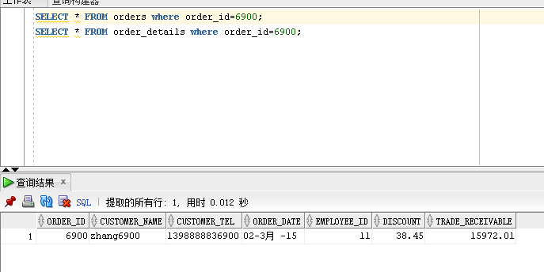

# 实验四
## 用户名：new_user_mark

#### 创建表和分区并插入数据

#### 查询某order_id为3040:
```sql
select * from orders where order_id=6900;
select * from order_details where order_id=6900;
```


#### 在order_details表中查询到该order_id:


#### 进行验证：


#### 更新order_id的product_num的数据：


#### 更新成功


#### order_details金额已改变

#### 再次进行验证


#### 删除数据


#### 插入数据


#### 验证插入


